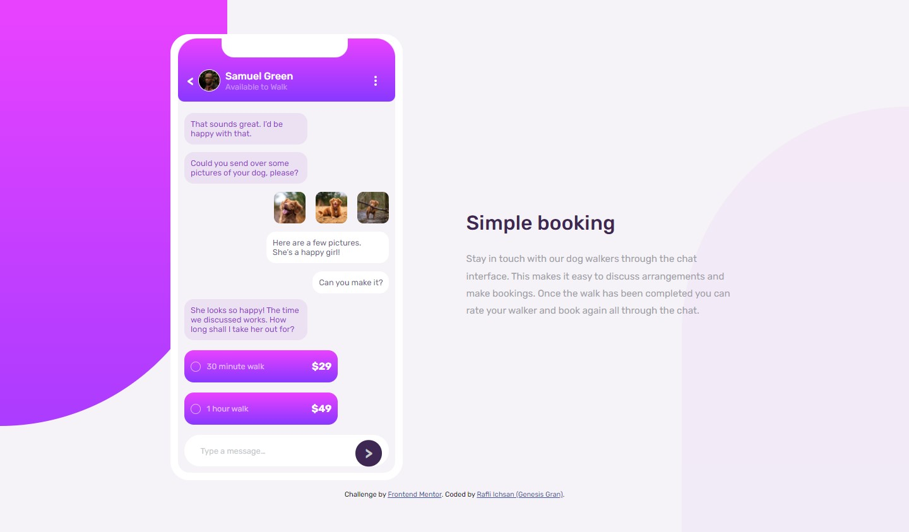

# Frontend Mentor - Chat app CSS illustration solution

This is a solution to the [Chat app CSS illustration challenge on Frontend Mentor](https://www.frontendmentor.io/challenges/chat-app-css-illustration-O5auMkFqY). Frontend Mentor challenges help you improve your coding skills by building realistic projects.

## Table of contents

- [Welcome!](#welcome!)
- [The challenge](#the-challenge)
- [Screenshot](#screenshot)
- [Links](#links)
- [Built with](#built-with)
- [Author](#author)

## Welcome!

Hello there! This is my solution to the [Chat app CSS illustration challenge on Frontend Mentor](https://www.frontendmentor.io/challenges/chat-app-css-illustration-O5auMkFqY). Feel free to give any suggestion or pointing out anything i miss.

### The challenge

Users should be able to:

- View the optimal layout for the component depending on their device's screen size
- **Bonus**: See the chat interface animate on the initial load

## Screenshot

## Links

- Solution URL: [https://www.frontendmentor.io/solutions/chat-app-illustration-using-html-css-flexbox-and-media-query-LbNeVqZ99]
- Live Site URL: [https://genesisgran.github.io/chat-app-illustration/]

## Built with

- Semantic HTML5 markup
- CSS custom properties
- Flexbox
- Media Query

## Author

- Frontend Mentor - [@GenesisGran](https://www.frontendmentor.io/profile/GenesisGran)
- Discord - Genesis Gran#9500
